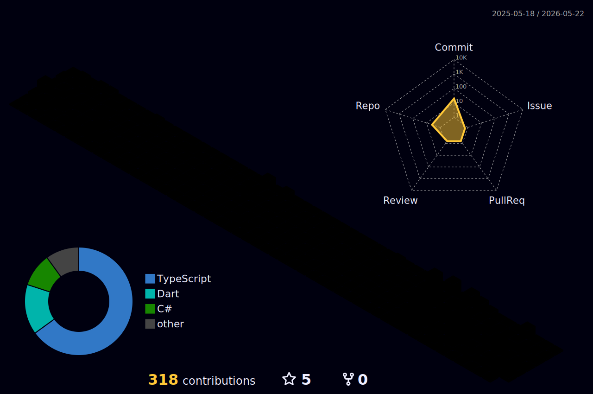

<h2 align="center">Emirhan Hasırcı</h2>
---

<!-- 3D KATKI EVRENİ (3D CONTRIBUTION GRAPH) -->
<h2 align="center">🌌 3D Katkı Evrenim (My 3D Contribution Universe)</h2>

  <i>GitHub üzerindeki geliştirme serüvenimin ve kodlama aktivitemin 3 boyutlu büyüleyici görselleştirmesi.</i>

  <!-- GitHub Actions iş akışı çalıştıktan sonra bu görsel otomatik olarak güncellenecektir -->
  

  💡 <i>Yukarıdaki 3D grafik, her gün gece yarısı <b>GitHub Actions</b> tarafından otomatik olarak en güncel verilerle yeniden oluşturulur.</i>

---

<!-- HAKKIMDA BÖLÜMÜ -->
## 🧑‍💻 Hakkımda

Merhaba! Ben **Emirhan**. Yazılım dünyasına büyük bir tutkuyla bağlı, sürekli yeni teknolojiler öğrenen ve projeler üreten bir geliştiriciyim. Kod yazarken hem estetiğe hem de işlevselliğe büyük önem veririm. Karmaşık problemleri basit, sürdürülebilir ve şık kod çözümlerine dönüştürmek en büyük motivasyon kaynağım.

* 🔭 **Şu Anda Ne Üzerinde Çalışıyorum:** Full-stack web teknolojileri ve modern kullanıcı arayüzleri geliştiriyorum.
* 🌱 **Şu Anda Ne Öğreniyorum:** İleri düzey JavaScript mimarileri, veri yapıları ve algoritmalar.
* ⚡ **Eğlenceli Gerçek:** Fikirlerimi hayata geçiren kodlar yazmak, benim için bir işten çok dijital bir sanat biçimi.
* 💬 **Bana Danışın:** Frontend geliştirme, modern web standartları ve arayüz tasarımları hakkında konuşmayı çok severim.

---

<!-- YETENEKLER & TEKNOLOJİLER -->
## 🛠️ Yetenekler & Teknolojiler

Geliştirme süreçlerimde kullandığım, uzmanlaştığım ve aktif olarak üzerinde çalıştığım teknolojiler:

### 💻 Frontend (Önyüz)

  
  
  
  
  
  

### ⚙️ Backend & Veritabanı

  
  
  
  

### 🔧 Araçlar & Diğerleri

  
  
  
  
  

---

<!-- GITHUB İSTATİSTİKLERİ BÖLÜMÜ -->
## 📊 Geliştirici İstatistikleri

Aşağıdaki kartlar, GitHub üzerindeki genel performansımı ve çalışma ritmimi gerçek zamanlı olarak yansıtmaktadır:

  
  

  

---

<!-- İLETİŞİM & SOSYAL MEDYA -->
## 🤝 Benimle İletişime Geçin!

Yeni projeler, iş birlikleri veya sadece kahve eşliğinde yazılım sohbetleri için bana her zaman ulaşabilirsiniz:

  
  

  Gezegenimize 🪐 ve kod dünyasına duyulan sevgiyle tasarlandı.

